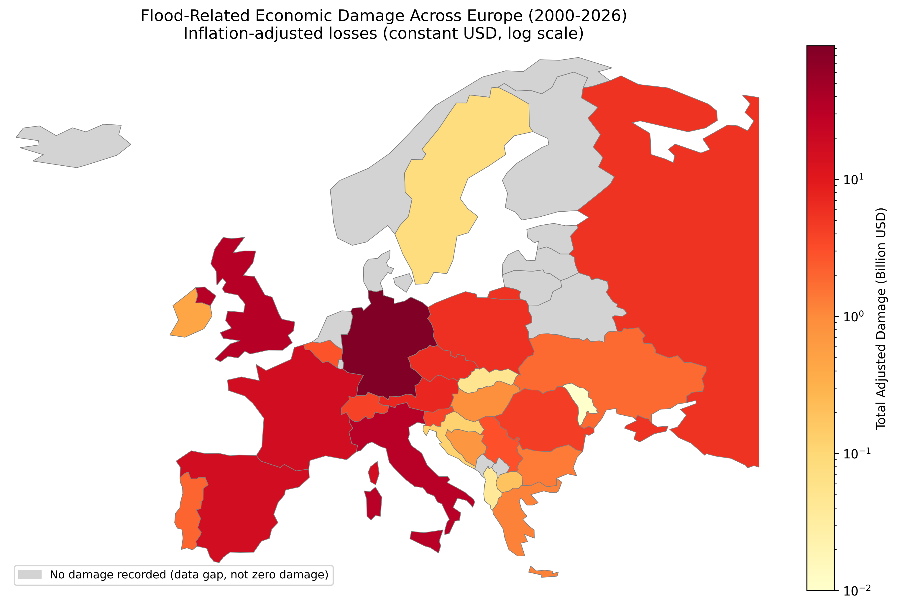

# Flood Risk in Europe
### Economic Losses, Mortality and Physical Climate Risk Insights (2000-2026)

## 🌊 Live Dashboard

**[View the interactive Streamlit dashboard →](https://flood-risk-europe.streamlit.app)**

The dashboard is the main deliverable of this project — nine tabs covering economic losses, insurance gap, mortality, vulnerability profiles, flood types and extreme events, all filterable live by country, flood type and year. The notebook and this README are the technical detail behind it.

## Overview
This project analyses over two decades of flood events across Europe using the EM-DAT International Disaster Database. It explores economic damage, human impact, insurance protection gaps and spatial patterns to provide insights relevant to climate risk assessment, insurance and financial risk disclosure frameworks such as TCFD.

## Why This Matters
For insurers and reinsurers, this analysis highlights which markets combine high flood losses with large protection gaps, supporting risk prioritisation and pricing decisions. For banks and infrastructure investors, the country-level exposure and vulnerability patterns provide a starting point for physical climate risk screening of lending portfolios and asset locations, ahead of more granular catastrophe modelling.

## Key Findings
- Germany exhibits the highest historical economic exposure to flood events in Europe (93.8B USD), largely driven by the 2021 Ahr Valley disaster.
- Italy shows the largest relative insurance protection gap within the insurance-matched subset: only 5% of total flood losses were insured (0.9B of 17.2B USD).
- Russia and Spain recorded the highest flood mortality despite lower economic losses than Germany or the UK.
- Among named flood types with a well-defined physical mechanism, flash floods show the highest mortality rate per event (5.94 deaths/event), consistent with IPCC AR6 projections. ("Flood (General)" — an EM-DAT catch-all category rather than a distinct hazard type — technically has a higher rate (7.49), but is excluded from this comparison since it isn't a specific flood mechanism; see the notebook's Flood Type Analysis section for the full caveat.)

## Climate Risk Framework
- **Hazard** - Flood types and historical events
- **Exposure** - Economic assets affected
- **Vulnerability** - Human impacts and insurance gaps

## Limitations
This project is based on historical disaster observations from EM-DAT and should not be interpreted as a predictive climate model. Reported damages may vary across countries due to differences in reporting practices and data availability. Only 37% of recorded events include economic damage figures, and just 10% include insured damage data — conclusions about losses and insurance gaps should be read as patterns within the available data, not the complete picture of real-world risk.

## Project Structure

    flood-risk-europe/
    ├── app.py                     # Streamlit dashboard (main deliverable)
    ├── analysis.ipynb             # Full analysis notebook
    ├── requirements.txt
    ├── .gitignore
    ├── scripts/
    │   └── generate_agg_data.py   # Regenerates the two aggregated CSVs below
    ├── data/
    │   ├── flood_agg.csv          # Not in repo — see Data & Licensing
    │   ├── top_events.csv         # Not in repo — see Data & Licensing
    │   ├── emdat_floods_europe.xlsx  # Not in repo — download your own copy
    │   └── external/
    │       └── API_NY.GDP.MKTP.CD_DS2_en_csv_v2_4569.csv   # World Bank GDP, public domain
    ├── images/                    # Static charts exported from the notebook
    └── README.md

## Data & Licensing

This project uses two data sources:

- **EM-DAT** (CRED, UCLouvain) — flood events across Europe, 2000-2026. Free for
  non-commercial/research use after registration at [public.emdat.be](https://public.emdat.be),
  but their [terms of use](https://doc.emdat.be/docs/legal/terms-of-use/) prohibit
  publicly redistributing the database or a substantial part of it. **For that
  reason, the raw EM-DAT export is never committed to this repo.**
- **World Bank GDP** (`NY.GDP.MKTP.CD`) — public domain, included directly in `data/external/`.

### What's actually in this repo

Instead of the raw EM-DAT file, `app.py` reads two small files derived from it:

| File | What it is | Powers |
|---|---|---|
| `data/flood_agg.csv` | Country x flood-type x year sums (damage, insured damage, deaths, affected), plus the event count behind each sum | Every dashboard tab except Extreme Events |
| `data/top_events.csv` | Europe's 30 costliest individual flood events (a curated ranking, not a database extract) | Extreme Events tab only |

Both are generated by `scripts/generate_agg_data.py` from your own local copy of
the EM-DAT export, and are themselves excluded from git — the deployed dashboard
fetches them from a private URL configured in Streamlit Cloud's Secrets, so the
app works with real data for every visitor without any EM-DAT-derived file ever
sitting in a publicly-cloneable location.

**One consequence worth knowing:** the Extreme Events tab can only rank individual
events among that curated top 30. If you filter to a country or period with no
events in that list, it doesn't mean there was no flood damage there — just that
none of it made Europe's 30 costliest events. Every other tab uses the full
aggregated data across all 493 recorded events, with no such limitation.

`analysis.ipynb` reads the raw Excel file directly and its own outputs are
already saved inside the notebook — you only need the raw file if you want to
re-run it yourself, not just read it on GitHub.

## Analysis Sections
1. Data Loading and Cleaning
2. Exploratory Analysis: Economic Losses
3. Trend Analysis
4. Insurance Gap Analysis
5. Mortality Analysis
6. Vulnerability Analysis
7. Flood Type Analysis
8. Extreme Events
9. Geographic Analysis
10. Climate Risk Implications

## Technologies

Methodology: Exploratory Data Analysis (EDA), Climate Risk Assessment, Spatial Analysis, Interactive Dashboarding

## How to Run

### Option A — Just explore the dashboard
No setup needed: **[open the live dashboard](https://flood-risk-europe.streamlit.app)**.

### Option B — Run the dashboard locally
1. Clone the repository
2. Install dependencies: `pip install -r requirements.txt`
3. Register for a free account at [public.emdat.be](https://public.emdat.be), download the flood events for Europe (2000-2026), and save as `data/emdat_floods_europe.xlsx`
4. Run `python scripts/generate_agg_data.py` — this writes `data/flood_agg.csv` and `data/top_events.csv`
5. `streamlit run app.py`

### Option C — Reproduce the full notebook
1. Clone the repository and install dependencies (as above)
2. Download your own copy of the EM-DAT export (as above), saved to `data/emdat_floods_europe.xlsx`
3. Open `analysis.ipynb` and run all cells

## About this Project
This project is part of my data portfolio focused on Climate Risk Analytics, combining data analysis, environmental datasets and risk assessment methodologies.

## Author
Sheila Alonso — Data Analyst | Climate Risk & ESG
[GitHub](https://github.com/AlonsoSheila) · [LinkedIn](https://www.linkedin.com/in/sheila-alonso-rodriguez/)
